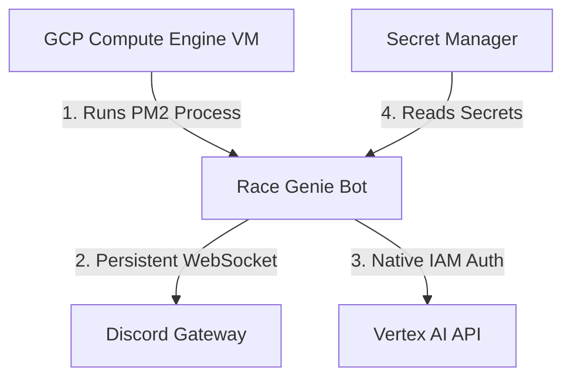

# GCP Hosting Plan: Race Genie Discord Bot

To host **Race Genie** on Google Cloud Platform (GCP) and avoid Render's Free Tier limitations (like cold starts and 15-minute spin-downs), you need a hosting model that supports **24/7 persistent execution**.

---

## 🏛️ 1. Architecture Options on GCP

Discord bots built on the Gateway API (like ours, using `discord.js`) rely on a **continuous WebSocket connection** to Discord's servers to receive commands. This limits the suitability of certain serverless platforms.

### ❌ Option A: Cloud Functions / Cloud Run (Serverless)
*   **Why it's not ideal**: Serverless services are event-driven and scale down to zero when idle. To keep a WebSocket open 24/7, you would have to pay to keep CPU allocated continuously, which is expensive and goes against the serverless design.
*   *Note: If you rewrote the bot to use Discord's Outgoing Webhooks (HTTPS endpoints), Cloud Run would be excellent, but it requires a public URL, SSL validation keys, and a major code rewrite.*

###  Option B: Compute Engine VM (Recommended)
*   **Why it is ideal**: You run a tiny, dedicated virtual machine (VM) 24/7. It maintains a persistent WebSocket connection, has zero cold-start delay, and is highly cost-effective.
*   **Sizing**: An `e2-micro` (2 vCPUs, 1GB RAM) or `e2-medium` instance is more than enough. *(An e2-micro is often covered by GCP's Free Tier, or costs ~$7/month otherwise).*

---

## 🗺️ 2. Step-by-Step Deployment Plan (VM Model)

If you decide to migrate to GCP Compute Engine, this is the blueprint:



### Phase 1: Infrastructure Provisioning
1.  **Create a VM Instance**:
    *   Navigate to **Compute Engine -> VM Instances**.
    *   Machine configuration: Series `E2`, Machine Type `e2-micro`.
    *   Boot Disk: `Ubuntu 24.04 LTS` (standard, easy to manage).
2.  **IAM & Identity**:
    *   Associate a **Service Account** with the VM.
    *   Grant this Service Account the **Vertex AI User** role. 
    *   *Security Benefit*: By doing this, the Node.js SDK on the VM automatically authenticates with Vertex AI using GCP internal metadata. **You do not need to upload or store a JSON key file!**

### Phase 2: Environment Setup
1.  Connect to the VM via SSH from the GCP console.
2.  Install **Node.js** and **Git**:
    ```bash
    sudo apt update
    sudo apt install -y nodejs npm git
    ```
3.  Install **PM2** (a production process manager for Node.js to keep your bot running 24/7 and restart it if it crashes):
    ```bash
    sudo npm install -g pm2
    ```

### Phase 3: Deployment & Secrets Configuration
1.  Clone your private repository:
    ```bash
    git clone <your-repo-url>
    cd race-genie
    npm install
    ```
2.  Configure secrets. Instead of a `.env` file, you can either:
    *   Export environment variables in Ubuntu (`/etc/environment`).
    *   (Best Practice) Read them from **GCP Secret Manager** using the VM's service account.
3.  Start the bot using PM2:
    ```bash
    pm2 start index.js --name "race-genie"
    ```
4.  Configure PM2 to start on system boot:
    ```bash
    pm2 startup
    pm2 save
    ```

---

## 🔒 3. Key Benefits of this GCP Setup
*   **Zero Cold Starts**: The bot is always online and responds within milliseconds to users.
*   **Keyless Security**: By leveraging GCP IAM Service Accounts on the VM, the Vertex AI calls are securely authenticated internally, avoiding any risk of leaking JSON keys.
*   **Full Control**: You can scale resources up or down easily if you decide to add databases, telemetry, or more complex tasks.
